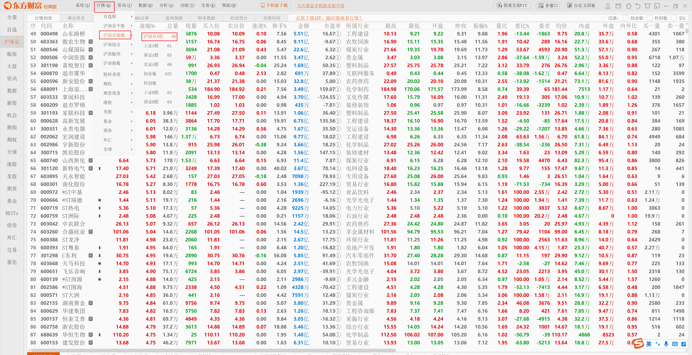
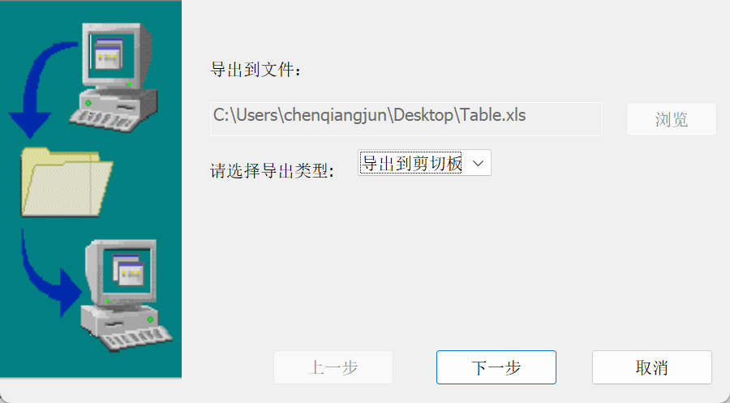
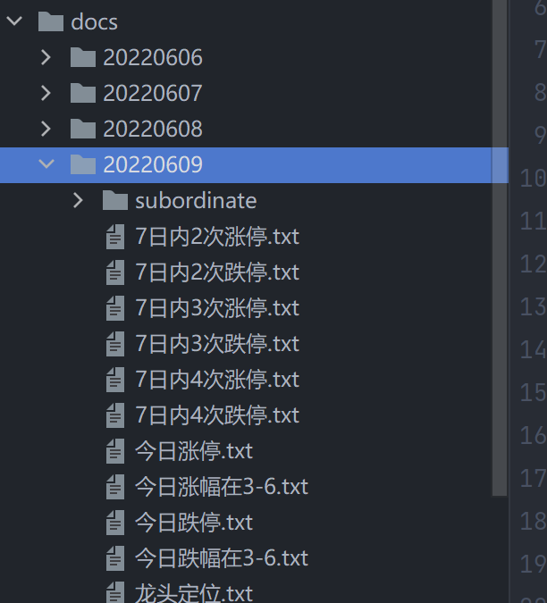

# 股市分析

<div align="center">
  <a href="https://alist.nn.ci"></a>
  <p><em>🗂️A file list program that supports multiple storage, powered by Gin and React.</em></p>
  <a href="https://github.com/Xhofe/alist/releases"></a>
  <a href="https://github.com/Xhofe/alist/discussions"></a>
  <a href="https://github.com/Xhofe/alist/actions?query=workflow%3ABuild"></a>
  <a href="https://github.com/Xhofe/alist/releases"></a>
  <a href="https://github.com/Xhofe/alist/blob/v2/LICENSE"></a>
  <a href="https://pay.xhofe.top">
    
  </a>
</div>

---

## 同步数据

### - step 1：下载数据数据

<div align=center>

</div>

<div align=center>

</div>

### - step 2：配置数据库

```
log_level = "DEBUG"

[mysql]
ip = "127.0.0.1"
port = 3306
user = "root"
password = "=nXCwk8l<@Dx5bL%"
database = "dongfang_stock"


[web]
port = 8080
```

### - step 3：开始同步

- 把剪切板的数据粘贴到`service/clipbroad/clipbroad.txt`文件
- 执行命令同步
```
go run cmd/cmd.go sync
```

## 每日分析报告

```
go run .\cmd\cmd.go report tofile
```

<div align=center>

</div>


## 最近涨停票走势

```
go run .\cmd\cmd.go report stion
```

<div align=center>

</div>