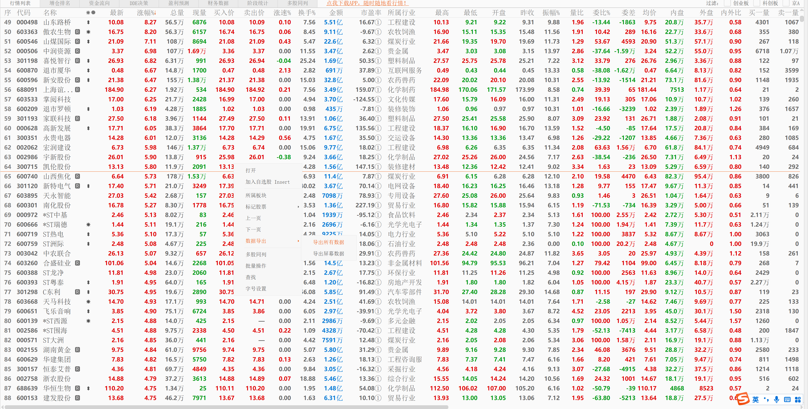

# 股市分析

常用小工具

- 同步数据

步骤1：下载数据数据




步骤2：配置数据库

```
log_level = "DEBUG"

[mysql]
ip = "127.0.0.1"
port = 3306
user = "root"
password = "=nXCwk8l<@Dx5bL%"
database = "dongfang_stock"


[web]
port = 8080
```

步骤3：开始同步
```
go run cmd/cmd.go sync
```

- 每日分析报告

```
go run .\cmd\cmd.go report tofile
```


- 最近7天，有两天是涨停的票

```
go run cmd/cmd.go report 7 2

7 日内，2 涨停记录[行业>三日涨幅]
+------------+--------+----------+-------+--------+------+---------+---------+
|    行业    |  代码  |   名称   | 市值  |   pe   | 涨幅 | 3日涨幅 | 6日涨幅 |
+------------+--------+----------+-------+--------+------+---------+---------+
|  食品饮料  | 000716 |  黑芝麻  | 28.5  | 111.6  | 10.1 |  22.4   |  23.9   |
|  铁路公路  | 603069 | 海汽集团 | 55.6  | -85.2  | 10.0 |  33.1   |  46.3   |
|  通用设备  | 000595 | 宝塔实业 | 90.0  | -170.7 | 10.0 |  33.0   |  77.1   |
|  通信设备  | 002296 | 辉煌科技 | 26.8  |  34.8  | 10.1 |  11.9   |  14.5   |
|  装修建材  | 002066 | 瑞泰科技 | 39.1  |  54.1  | 10.0 |  33.1   |  65.7   |
+------------+--------+----------+-------+--------+------+---------+---------+

[行业>市值]
+------------+--------+----------+-------+--------+------+---------+---------+
|    行业    |  代码  |   名称   | 市值  |   pe   | 涨幅 | 3日涨幅 | 6日涨幅 |
+------------+--------+----------+-------+--------+------+---------+---------+
|  家电行业  | 000521 | 长虹美菱 | 42.6  | 207.1  | 10.1 |   3.8   |  13.7   |
|  化学制品  | 603683 | 晶华新材 | 18.4  | 1365.7 | 10.0 |  11.5   |  14.6   |
|  农牧饲渔  | 600354 | 敦煌种业 | 46.9  | 146.4  | 10.0 |  33.1   |  35.4   |
|  仪器仪表  | 002819 | 东方中科 | 74.6  | -210.0 | 10.0 |  16.3   |  15.6   |
|  专用设备  | 000584 | 哈工智能 | 38.4  | -30.8  | 10.0 |  10.8   |  11.8   |
+------------+--------+----------+-------+--------+------+---------+---------+
```

- 当天涨停行业分布

```
go run cmd/cmd.go report today

今日涨停：[行业>市值]
+------------+--------+-------------+--------+---------+-------+---------+---------+
|    行业    |  代码  |    名称     |  市值  |   pe    | 涨幅  | 3日涨幅 | 6日涨幅 |
+------------+--------+-------------+--------+---------+-------+---------+---------+
|  食品饮料  | 600962 |  国投中鲁   |  35.5  |  210.7  | 10.0  |   1.2   |  25.9   |
|  食品饮料  | 000716 |   黑芝麻    |  34.5  |  134.9  | 10.0  |  33.0   |  47.0   |
+------------+--------+-------------+--------+---------+-------+---------+---------+

```

- 行业股票查询

```
go run cmd/cmd.go search sub 专用设备 中药

[行业>三日涨幅]
+----------+--------+----------+-------+---------+-------+---------+---------+
|   行业   |  代码  |   名称   | 市值  |   pe    | 涨幅  | 3日涨幅 | 6日涨幅 |
+----------+--------+----------+-------+---------+-------+---------+---------+
| 专用设备 | 688718 |  唯赛勃  | 34.1  | -3219.8 | 20.0  |  41.6   |  45.7   |
| 专用设备 | 688218 | 江苏北人 | 18.1  |  -91.8  | 11.5  |  33.1   |  38.6   |
| 专用设备 | 002786 | 银宝山新 | 31.2  |  -10.9  | -4.3  |  -8.0   |  -3.2   |
+----------+--------+----------+-------+---------+-------+---------+---------+

[行业>三日涨幅]
+------+--------+----------+--------+--------+------+---------+---------+
| 行业 |  代码  |   名称   |  市值  |   pe   | 涨幅 | 3日涨幅 | 6日涨幅 |
+------+--------+----------+--------+--------+------+---------+---------+
| 中药 | 603139 | 康惠制药 |  19.4  |  55.3  | 10.0 |  22.4   |  21.1   |
| 中药 | 600222 | 太龙药业 |  35.8  | 384.3  | 1.5  |   9.9   |  10.6   |
+------+--------+----------+--------+--------+------+---------+---------+
```